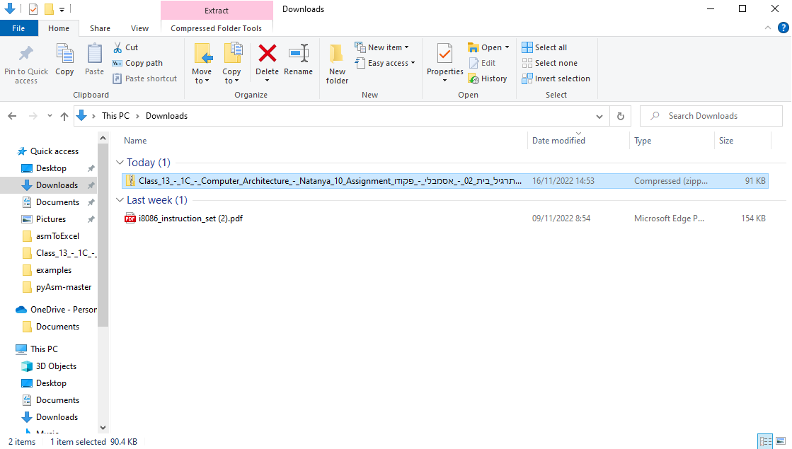
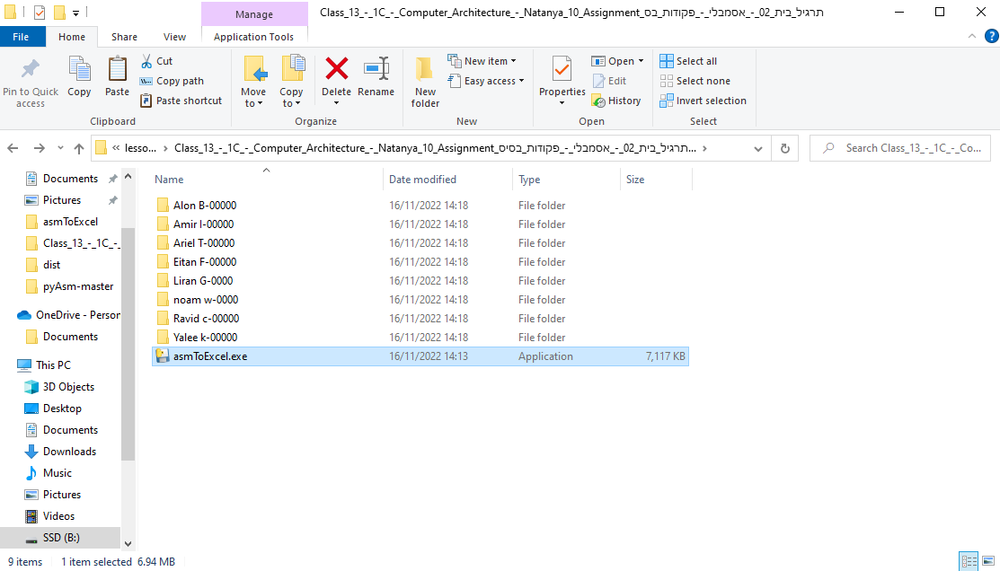
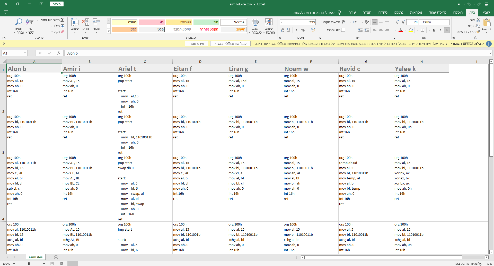

# asmToExcel
FOR MAGSHIMIM ARCHITECTURE INSTRUCTORS

⚡ For Faster Student Homework Checking ⚡

Description:

This program takes all the .asm files from subfolders and put them in excel file -> asmToExcel.xlsx .  
Each column is seperate student.  
Each row is student .asm file content.

★ Removes comments from files  
★ Reformats assembly code  
★ Visuallizing data for faster checkig  
★ Unzipping sub folders and organizing them  
★ One command to run

SETUP (Not neccasery):

1. download dist/asmToExcel.exe
2. Add the location of /asmToExcel.exe to PATH ( tutorial -> https://www.youtube.com/watch?v=5BTnfpIq5mI )
3. done.

USE:

1. download student homework archive and unzip it
2. open cmd in homework folder
3. write in cmd -> asmToExcel. execute the command

TO COMPILE:

pip install -r requirements.txt

TO CONVERT TO .EXE (via pyinstaller):

pyinstaller --collect-all patoolib -F -w asmToExcel.py

EXAMPLE: 

1. unzip the folder 

2. put /asmToExcel.exe from (GitHub) dist/asmToExcel.exe in the folder or run in cmd asmToExcel if you put it in PATH as a variable

3. You will get asmToExcel.xlsx file and it will organize the folders

